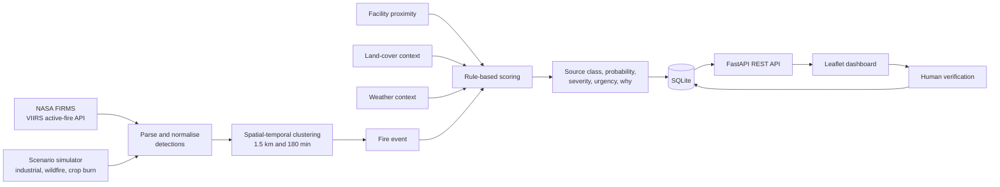

# SIH 162 — Fire Source Intelligence

**Turn raw satellite hotspots into explainable, prioritised fire events — and tell industrial fires apart from wildfires and crop burning.**


Built for the **Smart India Hackathon (SIH) — problem statement 162**.

<!--
  Add a screenshot of the dashboard here once you have one, e.g.:
  
-->

---

## Overview

Fire satellites such as VIIRS report *thermal anomalies*: points on the map that are hotter than their surroundings. A single detection is an **observation, not an incident**, and it does not say *what* is burning.

**Fire Source Intelligence** closes that gap:

1. It **groups** nearby detections in space and time into a single *fire event*.
2. It **enriches** each event with industrial-proximity, land-cover and weather context.
3. It **estimates the likely source** — industrial fire, wildfire, crop burn, or other thermal activity — with a probability.
4. It **scores severity and urgency** as a separate concept from the source, and lists the evidence behind every score.
5. It lets an **operator confirm or reject** each event on a live map, producing labelled feedback for future model training.

> [!NOTE]
> This is a **working prototype**. The full pipeline runs end-to-end on built-in simulated scenarios and on live NASA FIRMS data, but source classification on *real* detections is currently limited. Please read [Project status and known limitations](#project-status-and-known-limitations) before relying on any output.

## Table of contents

- [Features](#features)
- [How it works](#how-it-works)
  - [Pipeline](#pipeline)
  - [Event formation](#event-formation)
  - [Context used for scoring](#context-used-for-scoring)
  - [Scoring reference](#scoring-reference)
- [Tech stack](#tech-stack)
- [Project structure](#project-structure)
- [Getting started](#getting-started)
- [Using the dashboard](#using-the-dashboard)
- [Command-line tools](#command-line-tools)
- [REST API](#rest-api)
- [Data model](#data-model)
- [Experimental ML pipeline](#experimental-ml-pipeline)
- [Project status and known limitations](#project-status-and-known-limitations)
- [Roadmap ideas](#roadmap-ideas)
- [Troubleshooting](#troubleshooting)
- [Security notes](#security-notes)
- [Further reading](#further-reading)
- [Acknowledgements](#acknowledgements)
- [Authors](#authors)
- [Contributing](#contributing)
- [License](#license)

---

## Features

- **Real satellite data** — pulls VIIRS active-fire detections (NOAA-20, Suomi-NPP and NOAA-21, near-real-time) from the [NASA FIRMS](https://firms.modaps.eosdis.nasa.gov/api/) Area API.
- **Built-in scenario simulator** — reproducible synthetic scenarios (industrial fire, wildfire, crop burn, or a mix) so the whole pipeline can be demonstrated without waiting for a live satellite pass.
- **Event formation** — chains detections within 1.5 km and 180 minutes of each other into one fire event.
- **Source classification** — `industrial_fire`, `wildfire`, `crop_burn` or `other_thermal`, each with a probability.
- **Risk scoring** — severity (0–100), urgency (`LOW` / `MEDIUM` / `HIGH` / `CRITICAL`), anomaly score and spread risk.
- **Explainable by design** — every event carries a plain-language "Why?" list of the evidence behind its score.
- **Human-in-the-loop** — operators mark events *Confirmed*, *Uncertain* or *Rejected*; decisions are stored in a feedback table.
- **Live dashboard** — Leaflet map, metrics, event stream and a detail panel, refreshing every 5 seconds. No build step.
- **Clear data provenance** — every event and detection is tagged `SIMULATION` or `NASA_FIRMS`, so synthetic and real data are never confused.
- **REST API with interactive docs** — FastAPI serves Swagger UI at `/docs`.

---

## How it works

### Pipeline



The design rule is to keep **detection**, **event formation**, **source classification**, **severity** and **alert state** as separate concepts (see [`ARCHITECTURE.md`](ARCHITECTURE.md)).

### Event formation

Detections are linked into one event when they are within **1.5 km** and **180 minutes** of *any* detection already in the group (single-linkage), so an event can follow a moving fire front. For each event:

- **Position** is the mean latitude/longitude of its detections.
- **Persistence** is the number of detections in the event.
- **Duration** is the time between the first and last detection.
- **Peak FRP** (fire radiative power, MW) is the maximum FRP among its detections.

### Context used for scoring

| Signal | Source today |
| --- | --- |
| Distance to industrial infrastructure | Haversine distance to the nearest of **four built-in demo facilities** |
| Land cover | Derived from the **simulation scenario**; always `unknown` for NASA FIRMS data |
| Wind and humidity | **Fixed per-scenario values** (see below); the same defaults are used for NASA FIRMS data |
| Night-time | `true` if any detection falls before 06:00 or from 18:00 UTC onwards |

| Scenario | Land cover | Wind speed | Humidity (%) |
| --- | --- | --- | --- |
| `industrial` | `industrial` | 10 | 45 |
| `wildfire` | `forest` | 28 | 28 |
| `crop_burn` | `cropland` | 8 | 55 |
| NASA FIRMS (defaults) | `unknown` | 10 | 45 |

### Scoring reference

All scoring is transparent, rule-based Python in [`app.py`](app.py) (`classify()`).

**Industrial-source score** (0–100, capped):

| Signal | Condition | Points |
| --- | --- | --- |
| Distance to nearest facility | ≤ 0.5 km / ≤ 2 km / ≤ 5 km | +35 / +25 / +10 |
| Persistence (detections) | ≥ 8 / ≥ 4 / otherwise | +25 / +15 / +5 |
| Peak FRP | ≥ 100 / ≥ 40 / otherwise | +25 / +15 / +5 |
| Industrial land cover | yes | +15 |
| Night-time activity | yes | +5 |

**Source class** — the first matching rule wins:

| Order | Rule | Class | Probability |
| --- | --- | --- | --- |
| 1 | industrial score ≥ 70 | `industrial_fire` | industrial score ÷ 100 |
| 2 | land cover is `cropland` | `crop_burn` | max(0.55, 1 − industrial score ÷ 100) |
| 3 | land cover is `forest` or `grassland` | `wildfire` | max(0.55, 1 − industrial score ÷ 100) |
| 4 | otherwise | `other_thermal` | max(0.50, 1 − industrial score ÷ 100) |

**Spread risk** (0–100, capped): starts at 5, then adds +30 for forest/grassland, +20 / +10 for wind ≥ 25 / ≥ 12, +20 / +10 for humidity ≤ 30 / ≤ 50, +15 for persistence ≥ 6, and +15 for peak FRP ≥ 80.

**Severity** (0–100):

```text
severity = 0.225 × min(FRP, 200)
         + 0.25  × min(10 × persistence, 100)
         + 0.15  × min(duration_minutes ÷ 3, 100)
         + 0.15  × spread_risk
```

**Anomaly score** (0–100): `0.6 × min(FRP ÷ 2, 100) + 0.4 × min(10 × persistence, 100)`

**Urgency** is derived from severity: `CRITICAL` ≥ 80, `HIGH` ≥ 60, `MEDIUM` ≥ 35, otherwise `LOW`.

**"Why?" reasons** shown for an event may include: *near industrial infrastructure* (≤ 2 km), *persistent repeated detections* (≥ 6), *very high FRP* (≥ 100) or *elevated FRP* (≥ 40), *nighttime activity*, *industrial land-cover context*, and *elevated spread/weather risk* (spread risk ≥ 60).

> [!NOTE]
> Detection confidence (NASA's `l` / `n` / `h` flags are mapped to 30 / 60 / 90) is stored with each detection but is **not** used in scoring.

---

## Tech stack

| Layer | Technology |
| --- | --- |
| API | [FastAPI](https://fastapi.tiangolo.com/), served by [Uvicorn](https://www.uvicorn.org/); request validation with [Pydantic](https://docs.pydantic.dev/) v2 |
| Storage | SQLite via Python's built-in `sqlite3` (single file, created automatically) |
| Data ingestion | [NASA FIRMS](https://firms.modaps.eosdis.nasa.gov/api/) Area API via `requests`; configuration via `python-dotenv` |
| Dashboard | Vanilla HTML/CSS/JavaScript, [Leaflet](https://leafletjs.com/) 1.9.4 and OpenStreetMap tiles (loaded from CDNs, no build step) |
| Experimental ML | `pandas`, `numpy`, `scikit-learn`, `joblib` (offline scripts only — not used by the API) |

## Project structure

```text
.
├── app.py                # FastAPI app: clustering, scoring, SQLite storage, REST API
├── simulation.py         # CLI: streams simulated events into the database
├── fetch_firms.py        # CLI: downloads a raw NASA FIRMS CSV
├── test_firms.py         # NASA FIRMS connectivity check (not a unit-test suite)
├── prepare_training.py   # Experimental: builds weakly-labelled training data
├── train_model.py        # Experimental: trains a RandomForest on the weak labels
├── static/
│   └── dashboard.html    # Dashboard served at /dashboard
├── dashboard.html        # Alternate copy of the dashboard (not served by the API)
├── data/
│   ├── facilities.csv    # Demo facility reference table
│   ├── landcover.csv     # Demo land-cover reference table
│   └── weather.csv       # Demo weather reference table
├── ARCHITECTURE.md       # Logical pipeline and production target
├── SIMULATION_GUIDE.md   # Step-by-step demo script
├── requirements.txt
├── .env.example
└── .gitignore
```

Files created at runtime and excluded from version control: `fire_intelligence.db` (SQLite database), `data/raw_firms.csv` (last FIRMS download), `models/*.joblib` (trained model), and `.env` (your secrets). `data/training_ready.csv` is written by `prepare_training.py`.

> [!NOTE]
> The three `data/*.csv` reference tables document the demo context, but the API currently uses equivalent values built into `app.py` and does not read them.

---

## Getting started

### Prerequisites

- **Python 3.10 or newer** (developed on Python 3.14)
- `git` and `pip`
- An internet connection — the dashboard loads Leaflet and map tiles from CDNs, and NASA data is fetched over HTTPS
- *Optional:* a free **NASA FIRMS `MAP_KEY`**, required only for real satellite data — request one from the [FIRMS API page](https://firms.modaps.eosdis.nasa.gov/api/)

### Installation

```bash
git clone https://github.com/<your-username>/<repo-name>.git
cd <repo-name>

python -m venv .venv
```

Activate the virtual environment:

```bash
# Windows (PowerShell)
.venv\Scripts\Activate.ps1

# Windows (Command Prompt)
.venv\Scripts\activate.bat

# macOS / Linux
source .venv/bin/activate
```

Install the dependencies:

```bash
pip install -r requirements.txt
```

> [!TIP]
> The API itself only needs `fastapi`, `uvicorn`, `pydantic`, `requests` and `python-dotenv`. The remaining packages in `requirements.txt` (`pandas`, `numpy`, `scikit-learn`, `joblib`) are used only by the [experimental ML scripts](#experimental-ml-pipeline). For a lighter install:
> `pip install fastapi uvicorn pydantic requests python-dotenv`

### Configuration

The simulator works with no configuration. To fetch **real NASA FIRMS data**, create a file named `.env` in the project root:

```env
FIRMS_MAP_KEY=your_nasa_firms_map_key
```

| Variable | Required | Description |
| --- | --- | --- |
| `FIRMS_MAP_KEY` | Only for real data | Your NASA FIRMS `MAP_KEY`. The API and `fetch_firms.py` also accept `MAP_KEY` as an alias, but `test_firms.py` reads only `FIRMS_MAP_KEY`, so prefer that name. |

> [!WARNING]
> Never commit `.env` or share your key. `.env` is already listed in `.gitignore`.

### Run

```bash
uvicorn app:app --reload
```

Then open:

| URL | What you get |
| --- | --- |
| http://127.0.0.1:8000/dashboard | The dashboard |
| http://127.0.0.1:8000/docs | Interactive API documentation (Swagger UI) |

The SQLite database (`fire_intelligence.db`) is created automatically on first start.

### Quick demo (no API key needed)

1. Open the dashboard and click **▶ Run simulation**.
2. Select an event on the map to see its source class, probability, severity and "Why?" evidence.
3. Click **Confirm**, **Uncertain** or **Reject** to record a human verification.

To stream events continuously while the dashboard is open, run this in a second terminal:

```bash
python simulation.py --scenario mixed --events 20 --delay 0.5
```

---

## Using the dashboard

The dashboard has three columns: controls and the event stream on the left, the map in the centre, and event details on the right. It polls the API every 5 seconds.

| Control | What it does |
| --- | --- |
| **Fetch NASA FIRMS** | Downloads real detections for the chosen satellite (VIIRS NOAA-20, Suomi-NPP or NOAA-21 NRT) and number of days (1, 2 or 5), clusters them into events and stores them. The dashboard always requests the bounding box `68,6,97,36` (west, south, east, north — roughly India). Requires `FIRMS_MAP_KEY`. |
| **Run simulation** | Generates 8 simulated events of 8 detections each for the chosen scenario: *Mixed*, *Industrial fire*, *Wildfire* or *Crop burn*. |
| **Reset events** | Deletes **all** events, detections and feedback — including real NASA data. |
| **Metrics** | Total events, NASA vs simulated counts, High/Critical count, industrial count and average severity. |
| **Event stream** | Every stored event with its urgency, data-source tag, class, detection count and severity. |
| **Map** | One marker per event; marker size grows with severity. Click a marker (or a stream entry) to open its details. |
| **Event intelligence** | Data source, class, probability, severity, urgency, peak FRP, detection count, industrial distance, land cover, the "Why?" list, and the verification buttons. |

Simulated and real events are always labelled `SIMULATION` or `NASA_FIRMS`.

---

## Command-line tools

### `simulation.py` — stream simulated events

Writes directly to the same database the API uses, so events appear on the dashboard within a few seconds.

```bash
python simulation.py --scenario industrial --events 8 --delay 0.8
```

| Option | Default | Description |
| --- | --- | --- |
| `--scenario` | `mixed` | `industrial`, `wildfire`, `crop_burn` or `mixed` (cycles through the three) |
| `--events` | `10` | Number of events to generate |
| `--detections-per-event` | `8` | Detections in each event |
| `--delay` | `0.5` | Seconds to wait between events |

Example output:

```text
Open http://127.0.0.1:8000/dashboard
EV-886C80EA industrial_fire HIGH 73.9
EV-5CCAFFF8 wildfire HIGH 69.7
EV-2EFD9A16 crop_burn MEDIUM 47.1
```

### `fetch_firms.py` — download raw FIRMS data

Saves the raw CSV only; it does **not** create events. To create events from live data, use the dashboard button or [`POST /firms/fetch`](#rest-api).

```bash
python fetch_firms.py --days 2 --output data/raw_firms.csv
```

| Option | Default | Description |
| --- | --- | --- |
| `--source` | `VIIRS_NOAA20_NRT` | FIRMS data source (also `VIIRS_SNPP_NRT`, `VIIRS_NOAA21_NRT`) |
| `--days` | `1` | Days of data to request |
| `--area` | `68,6,97,36` | Bounding box as `west,south,east,north` |
| `--output` | `data/raw_firms.csv` | Where to save the CSV |

### `test_firms.py` — connectivity check

Confirms your `MAP_KEY` works by requesting one day of data and printing the row count, the first five detections and the available columns.

```bash
python test_firms.py
```

---

## REST API

Interactive documentation is available at `/docs` while the server is running. The database is shared by all endpoints.

| Method | Path | Description |
| --- | --- | --- |
| `GET` | `/` | Returns the project name and `"status": "online"` |
| `GET` | `/dashboard` | Serves the dashboard |
| `GET` | `/events?limit=500` | Lists events, most recently updated first. `limit` defaults to 500 and is capped at 1000 |
| `GET` | `/events/{event_id}` | One event plus all of its detections. `404` if not found |
| `POST` | `/simulate` | Generates simulated events |
| `POST` | `/firms/fetch` | Fetches real NASA FIRMS detections and creates events |
| `POST` | `/events/{event_id}/verify` | Records a human verification |
| `POST` | `/simulation/reset` | Deletes **all** events, detections and feedback |

Requests with an invalid body return `422`.

### `POST /simulate`

| Field | Type | Default | Allowed |
| --- | --- | --- | --- |
| `scenario` | string | `mixed` | `industrial`, `wildfire`, `crop_burn`, `mixed` |
| `events` | integer | `8` | 1–100 |
| `detections_per_event` | integer | `8` | 2–30 |

```bash
curl -X POST http://127.0.0.1:8000/simulate \
  -H "Content-Type: application/json" \
  -d '{"scenario": "industrial", "events": 1, "detections_per_event": 8}'
```

```json
{
  "created": 1,
  "events": [
    {
      "event_id": "EV-266BA570",
      "scenario": "industrial",
      "data_source": "SIMULATION",
      "latitude": 13.1329,
      "longitude": 80.3114,
      "detection_count": 8,
      "max_frp": 177.9706,
      "industrial_distance_km": 2.348,
      "source_class": "industrial_fire",
      "source_probability": 0.8,
      "anomaly_score": 85.4,
      "severity": 75.5,
      "urgency": "HIGH",
      "spread_risk": 45,
      "explanation": [
        "persistent repeated detections",
        "very high FRP",
        "nighttime activity",
        "industrial land-cover context"
      ]
    }
  ]
}
```

> [!NOTE]
> Here `explanation` is a list and `spread_risk` is included. In `GET /events` and `GET /events/{event_id}`, `explanation` is a single string with reasons joined by `"; "`, and `spread_risk` is not stored.

### `POST /firms/fetch`

| Field | Type | Default | Allowed |
| --- | --- | --- | --- |
| `source` | string | `VIIRS_NOAA20_NRT` | Any FIRMS Area API source, e.g. `VIIRS_SNPP_NRT`, `VIIRS_NOAA21_NRT` |
| `days` | integer | `1` | 1–10 |
| `area` | string | `68,6,97,36` | `west,south,east,north` |

```bash
curl -X POST http://127.0.0.1:8000/firms/fetch \
  -H "Content-Type: application/json" \
  -d '{"source": "VIIRS_NOAA20_NRT", "days": 1, "area": "68,6,97,36"}'
```

Example response (the counts are illustrative and depend on the day and area):

```json
{
  "source": "NASA_FIRMS",
  "detections": 412,
  "created_events": 281,
  "source_satellite": "VIIRS_NOAA20_NRT",
  "area": "68,6,97,36",
  "days": 1
}
```

The raw response is saved to `data/raw_firms.csv`. Errors: `500` if no key is configured, `502` if the request to NASA fails. If NASA returns no usable detections, the response contains `"detections": 0` and an explanatory `message`.

### `POST /events/{event_id}/verify`

| Field | Type | Allowed |
| --- | --- | --- |
| `label` | string | `confirmed`, `uncertain`, `rejected` |
| `comment` | string | Optional free text |

```bash
curl -X POST http://127.0.0.1:8000/events/EV-266BA570/verify \
  -H "Content-Type: application/json" \
  -d '{"label": "confirmed", "comment": "Verified with site team"}'
```

The event's `alert_status` changes from `NEW` to `CONFIRMED`, `UNCERTAIN` or `REJECTED`, and the decision is appended to the `feedback` table.

> [!WARNING]
> `POST /simulation/reset` deletes **every** event, detection and feedback record, not just simulated ones. There is no authentication on any endpoint (see [Security notes](#security-notes)).

---

## Data model

The database is created by `init_db()` in `app.py`.

**`events`** — one row per fire event

| Column | Description |
| --- | --- |
| `event_id` | Primary key, e.g. `EV-266BA570` |
| `created_at`, `updated_at` | ISO-8601 UTC timestamps |
| `scenario` | `industrial`, `wildfire`, `crop_burn`, or `firms` for real data |
| `data_source` | `SIMULATION` or `NASA_FIRMS` |
| `latitude`, `longitude` | Mean position of the event's detections |
| `detection_count` | Number of detections (persistence) |
| `max_frp`, `mean_frp` | Peak and mean fire radiative power (MW) |
| `duration_minutes` | Time between first and last detection |
| `industrial_distance_km` | Distance to the nearest built-in facility, however far away |
| `facility_type` | Type of that nearest facility |
| `landcover` | `industrial`, `forest`, `cropland` or `unknown` |
| `source_class`, `source_probability` | Estimated source and its probability |
| `anomaly_score`, `severity`, `urgency` | Risk scores (see [Scoring reference](#scoring-reference)) |
| `alert_status` | `NEW`, `CONFIRMED`, `UNCERTAIN` or `REJECTED` |
| `explanation` | The "Why?" reasons, joined by `"; "` |

**`detections`** — one row per satellite detection: `id`, `event_id`, `timestamp`, `latitude`, `longitude`, `frp`, `bright_ti4`, `confidence`, `satellite`, `scenario`, `data_source`.

**`feedback`** — one row per human verification: `id`, `event_id`, `label`, `comment`, `created_at`.

Older databases are migrated on startup: the `data_source` column is added to `events` and `detections` if it is missing.

---

## Experimental ML pipeline

Three scripts explore a machine-learning classifier trained offline on NASA FIRMS data. **They are not connected to the API**: the running system classifies events with the rule-based `classify()` function described in [Scoring reference](#scoring-reference).

```bash
python fetch_firms.py --days 2     # 1. download data/raw_firms.csv
python prepare_training.py         # 2. build data/training_ready.csv with weak labels
python train_model.py              # 3. train and save models/fire_source_model.joblib
```

**Features** (8): `latitude`, `longitude`, `frp`, `confidence_score`, `hour_utc`, `is_night`, `hotspot_density`, `persistence_count`.

**Weak labels.** There is no ground truth in raw FIRMS data, so `prepare_training.py` derives labels from heuristics. `hotspot_density` counts detections falling in the same 0.01° grid cell across the whole file. A detection counts as *persistent* at 3 or more, *high FRP* at or above the file's 75th percentile, and *night* between 18:00 and 06:00 UTC.

| Weak label | Rule |
| --- | --- |
| `industrial_persistent` | persistent **and** high FRP **and** night |
| `vegetation_fire` | not persistent **and** high FRP |
| `agricultural_burn` | not persistent **and** not high FRP |
| `other_thermal` | everything else |

**Model.** `RandomForestClassifier` (400 trees, max depth 14, `min_samples_leaf=2`, `class_weight="balanced_subsample"`), trained on a stratified 80/20 split with `random_state=42`. A classification report is printed, and the saved `.joblib` file bundles the model, its label encoder, the feature list and a `weak labels` warning.

> [!IMPORTANT]
> Read the metrics with care:
> - The labels are computed from the same features the model sees, so high scores show that the model has re-learned the heuristic, **not** that it identifies real fire sources.
> - The class names differ from the runtime ones (`industrial_persistent` / `vegetation_fire` / `agricultural_burn` vs `industrial_fire` / `wildfire` / `crop_burn`).
> - `latitude` and `longitude` as features let the model memorise geography.
> - `MODEL_PATH` in `.env.example` is reserved for future integration and is not read by the current code.
>
> A scientifically meaningful model needs human-verified incident labels and validation on held-out geographic regions. The dashboard's verification buttons exist to start collecting those labels.

---

## Project status and known limitations

This is a hackathon-stage prototype. It is best used to demonstrate the architecture and the human-in-the-loop workflow.

- **Simulations are synthetic.** They show the pipeline's behaviour; they are not evidence of model accuracy on real fires.
- **Classification on real NASA data is currently limited.** Land cover is always `unknown`, weather is a fixed default, and only four demo facilities exist, so real detections can only be labelled `industrial_fire` or `other_thermal` — in practice almost always `other_thermal`. In a test on roughly 2,000 real detections over India, every resulting event was `other_thermal` and all but three were `LOW` urgency. `wildfire` and `crop_burn` are currently reachable only through the simulator.
- **Facilities are demo data.** The four "Demo …" sites are hard-coded in `app.py`; `data/facilities.csv` is not loaded.
- **The trained model is not integrated** (see [Experimental ML pipeline](#experimental-ml-pipeline)).
- **No de-duplication.** Every fetch creates new events with new IDs, so re-fetching the same window duplicates them. Use **Reset events** (or delete `fire_intelligence.db`) to start clean.
- **Reset is destructive** and clears real data as well as simulated data.
- **Development-grade security.** There is no authentication, and CORS allows all origins.
- **Dashboard constraints.** It needs internet access for Leaflet and map tiles, always requests the same FIRMS bounding box, and runs simulations at a fixed size (8 events × 8 detections).
- **Thermal anomalies are not confirmed fires.** FIRMS reports heat detections; source classification here is contextual inference, not NASA ground truth.
- **SQLite** suits a single-user demo, not concurrent production load.
- **No automated test suite** yet (`test_firms.py` is a connectivity script).

## Roadmap ideas

Drawn from [`ARCHITECTURE.md`](ARCHITECTURE.md) and the limitations above:

- [ ] Replace the fixed land-cover and weather values with real data sources (for example a global land-cover product and a weather API)
- [ ] Load a real industrial-facility layer instead of four demo sites
- [ ] De-duplicate and incrementally update events when data is re-fetched
- [ ] Integrate a trained source model, trained on human-verified labels and validated across regions
- [ ] Add a separate anomaly model alongside the source model
- [ ] Add alerting (email, SMS or webhooks) for `HIGH` and `CRITICAL` events
- [ ] Add authentication and restrict CORS
- [ ] Move to PostgreSQL/PostGIS with background workers, WebSocket updates, a model registry and monitoring (the production target in `ARCHITECTURE.md`)
- [ ] Add automated tests and CI

---

## Troubleshooting

| Symptom | Cause and fix |
| --- | --- |
| `FIRMS_MAP_KEY is missing from .env` (HTTP 500) | Create `.env` in the project root with `FIRMS_MAP_KEY=...`, then **restart** the server — the file is read at startup. |
| `NASA FIRMS request failed` (HTTP 502) | Check your key, your internet connection, that the source name is valid, that `days` is 1–10, and that `area` is `west,south,east,north`. |
| "NASA returned no usable detections" | Widen the area or increase the number of days. |
| The map is grey or blank | The dashboard loads Leaflet and OpenStreetMap tiles from the internet; check your connection and any firewall or ad-blocker. |
| Events appear twice after fetching again | Expected (no de-duplication). Click **Reset events** or delete `fire_intelligence.db`. |
| `test_firms.py`: "FIRMS_MAP_KEY not found" | That script reads only `FIRMS_MAP_KEY`; rename `MAP_KEY` in your `.env`. |
| PowerShell refuses to activate the virtual environment | Use `.venv\Scripts\activate.bat` in Command Prompt, or run `Set-ExecutionPolicy -Scope Process -ExecutionPolicy RemoteSigned` first. |
| Port 8000 is already in use | Start on another port: `uvicorn app:app --reload --port 8001`. |

## Security notes

- Keep your `MAP_KEY` in `.env` only. If it has ever been committed, pasted into an issue, or shared in an archive, request a new key from NASA.
- The API has **no authentication** and allows requests from any origin. Do not expose it to the public internet as-is.
- `POST /simulation/reset` can wipe the whole database with a single unauthenticated request.

---

## Further reading

- [`ARCHITECTURE.md`](ARCHITECTURE.md) — the logical pipeline and the production target
- [`SIMULATION_GUIDE.md`](SIMULATION_GUIDE.md) — a step-by-step demo script, with suggested talking points for presenting the project

## Acknowledgements

- Active-fire data courtesy of [NASA FIRMS](https://firms.modaps.eosdis.nasa.gov/) (Fire Information for Resource Management System).
- Maps powered by [Leaflet](https://leafletjs.com/), with tiles © [OpenStreetMap](https://www.openstreetmap.org/copyright) contributors.
- Built with [FastAPI](https://fastapi.tiangolo.com/), [Pydantic](https://docs.pydantic.dev/) and [scikit-learn](https://scikit-learn.org/).

## Authors

- **Pranesh**

<!-- Add your teammates here, e.g. - **Name** ([@github-handle](https://github.com/github-handle)) -->

## Contributing

Issues and pull requests are welcome. For larger changes, please open an issue first to discuss what you would like to change. When contributing, keep detection, event formation, source classification, severity and alert state as separate concepts. Tests are especially appreciated, since the project has none yet.

## License

This project does not yet include a license file. Add a `LICENSE` file to state how others may use, modify and distribute the code.
